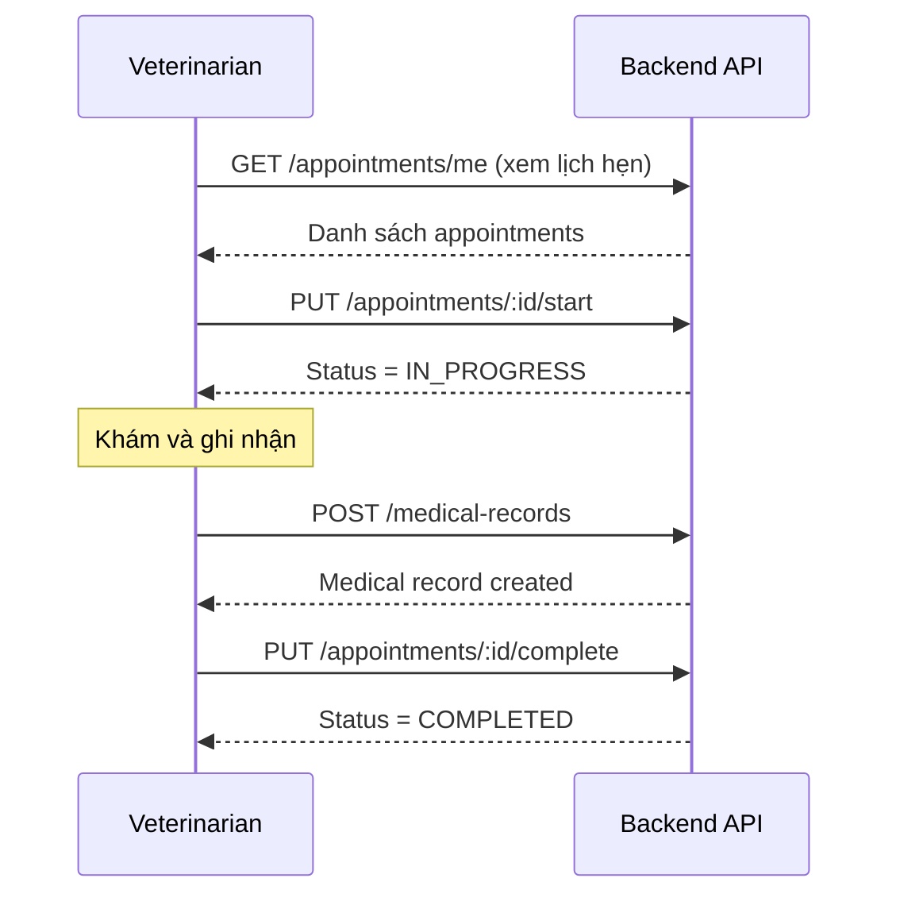
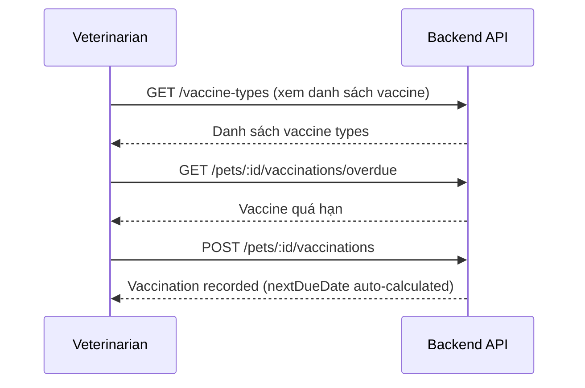
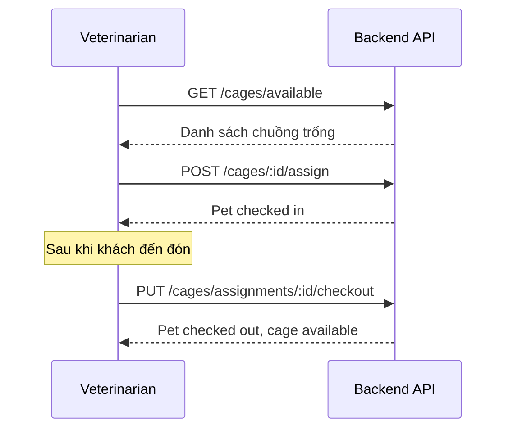

# API Dành Cho Bác Sĩ Thú Y (Veterinarian)

> **Tài liệu API Backend** - Cập nhật: 10/01/2026
>
> File này mô tả chi tiết tất cả các API mà bác sĩ thú y (VETERINARIAN) có thể truy cập, bao gồm endpoints, DTOs, quyền truy cập và các ví dụ sử dụng.

---

## Mục Lục

1. [Tổng Quan](#tổng-quan)
2. [Xác Thực (Authentication)](#xác-thực-authentication)
3. [Appointment APIs](#appointment-apis)
4. [Medical Record APIs](#medical-record-apis)
5. [Vaccination APIs](#vaccination-apis)
6. [Cage Management APIs](#cage-management-apis)
7. [Schedule APIs](#schedule-apis)
8. [Enums & Types](#enums--types)

---

## Tổng Quan

### Base URL
```
http://localhost:3000/api
```

### Authorization Header
```
Authorization: Bearer <JWT_TOKEN>
```

### Response Format
```json
{
  "success": true,
  "data": {...},
  "message": "Success message"
}
```

### User Role
Bác sĩ thú y được định nghĩa với role:
```typescript
UserType.VETERINARIAN = 'VETERINARIAN'
```

---

## Xác Thực (Authentication)

### Đăng nhập
```http
POST /api/accounts/login
```

**Request Body:**
```json
{
  "email": "vet@example.com",
  "password": "password123"
}
```

**Response:**
```json
{
  "success": true,
  "data": {
    "accessToken": "eyJhbGciOiJIUzI1NiIs...",
    "user": {
      "accountId": 1,
      "email": "vet@example.com",
      "userType": "VETERINARIAN",
      "employee": {
        "employeeId": 1,
        "fullName": "Dr. Nguyen Van A",
        "phoneNumber": "0901234567"
      }
    }
  }
}
```

---

## Appointment APIs

### 1. Lấy Danh Sách Lịch Hẹn Của Tôi

```http
GET /api/appointments/me
```

**Quyền:** `VETERINARIAN`, `PET_OWNER`, `CARE_STAFF`

**Query Parameters:**
| Param | Type | Required | Description |
|-------|------|----------|-------------|
| `status` | `AppointmentStatus` | ❌ | Lọc theo trạng thái |

**Response:**
```json
{
  "success": true,
  "data": [
    {
      "appointmentId": 1,
      "appointmentDate": "2026-01-10",
      "startTime": "09:00",
      "endTime": "10:00",
      "status": "CONFIRMED",
      "notes": "Khám định kỳ",
      "pet": {
        "petId": 1,
        "name": "Lucky",
        "species": "Dog",
        "breed": "Golden Retriever",
        "owner": {
          "petOwnerId": 1,
          "fullName": "Nguyễn Văn B",
          "phoneNumber": "0912345678"
        }
      },
      "service": {
        "serviceId": 1,
        "serviceName": "General Checkup",
        "price": 200000
      }
    }
  ]
}
```

---

### 2. Lấy Lịch Hẹn Theo Nhân Viên

```http
GET /api/appointments/by-employee/:employeeId
```

**Quyền:** `VETERINARIAN`, `CARE_STAFF`, `MANAGER`, `RECEPTIONIST`

**Path Parameters:**
| Param | Type | Description |
|-------|------|-------------|
| `employeeId` | `number` | ID nhân viên (bác sĩ) |

---

### 3. Lấy Chi Tiết Lịch Hẹn

```http
GET /api/appointments/:id
```

**Quyền:** `VETERINARIAN`, `MANAGER`, `RECEPTIONIST`, `PET_OWNER`, `CARE_STAFF`

---

### 4. Bắt Đầu Khám (Start Appointment)

```http
PUT /api/appointments/:id/start
```

**Quyền:** `VETERINARIAN`, `CARE_STAFF`, `MANAGER`

**Mô tả:** Chuyển trạng thái từ `CONFIRMED` → `IN_PROGRESS`

**Response:**
```json
{
  "success": true,
  "data": {
    "appointmentId": 1,
    "status": "IN_PROGRESS",
    "...": "..."
  },
  "message": "Start appointment"
}
```

---

### 5. Hoàn Thành Khám (Complete Appointment)

```http
PUT /api/appointments/:id/complete
```

**Quyền:** `VETERINARIAN`, `CARE_STAFF`, `MANAGER`

**Mô tả:** Chuyển trạng thái từ `IN_PROGRESS` → `COMPLETED`

**Request Body (optional):**
```json
{
  "actualCost": 250000
}
```

---

### 6. Lấy Lịch Hẹn Theo Thú Cưng

```http
GET /api/appointments/by-pet/:petId
```

**Quyền:** `VETERINARIAN`, `PET_OWNER`, `MANAGER`, `RECEPTIONIST`

---

## Medical Record APIs

### 1. Lấy Hồ Sơ Bệnh Án Của Tôi

```http
GET /api/medical-records/me
```

**Quyền:** `VETERINARIAN` (chỉ xem hồ sơ do mình tạo)

---

### 2. Lấy Tất Cả Hồ Sơ Bệnh Án

```http
GET /api/medical-records
```

**Quyền:** `VETERINARIAN`, `MANAGER`

---

### 3. Tạo Hồ Sơ Bệnh Án

```http
POST /api/medical-records
```

**Quyền:** `VETERINARIAN`, `MANAGER`

**Request Body - CreateMedicalRecordDto:**

| Field | Type | Required | Description |
|-------|------|----------|-------------|
| `petId` | `number` | ⚠️ Conditional | ID thú cưng (bắt buộc nếu không có appointmentId) |
| `veterinarianId` | `number` | ✅ | ID bác sĩ thú y (phải có role VETERINARIAN) |
| `diagnosis` | `string` | ✅ | Chẩn đoán |
| `treatment` | `string` | ✅ | Phương pháp điều trị |
| `appointmentId` | `number` | ❌ | ID lịch hẹn liên kết |
| `medicalSummary` | `object` | ❌ | JSONB - Tổng kết y tế linh hoạt |
| `followUpDate` | `string (ISO 8601)` | ❌ | Ngày tái khám |

**Ví dụ Request:**
```json
{
  "petId": 1,
  "veterinarianId": 3,
  "diagnosis": "Viêm đường hô hấp trên",
  "treatment": "Kháng sinh Amoxicillin 250mg, 2 lần/ngày x 7 ngày. Bổ sung vitamin C",
  "appointmentId": 5,
  "medicalSummary": {
    "symptoms": "Ho, sổ mũi, sốt nhẹ 38.5°C",
    "prescription": "Amoxicillin 250mg, Vitamin C 500mg",
    "notes": "Theo dõi 3 ngày, nếu không đỡ cần tái khám"
  },
  "followUpDate": "2026-01-17"
}
```

**Response - MedicalRecordResponseDto:**

| Field | Type | Description |
|-------|------|-------------|
| `id` | `number` | ID hồ sơ |
| `petId` | `number` | ID thú cưng |
| `veterinarianId` | `number` | ID bác sĩ |
| `appointmentId` | `number \| null` | ID lịch hẹn (nếu có) |
| `diagnosis` | `string` | Chẩn đoán |
| `treatment` | `string` | Điều trị |
| `medicalSummary` | `object \| null` | JSONB tổng kết |
| `followUpDate` | `Date \| null` | Ngày tái khám |
| `isFollowUpOverdue` | `boolean` | **Computed** - Đã quá hạn tái khám? |
| `needsFollowUp` | `boolean` | **Computed** - Cần tái khám? |
| `examinationDate` | `Date` | Ngày khám |
| `createdAt` | `Date` | Ngày tạo |

---

### 4. Cập Nhật Hồ Sơ Bệnh Án

```http
PUT /api/medical-records/:id
```

**Quyền:** `VETERINARIAN`, `MANAGER`

**Request Body - UpdateMedicalRecordDto:**
Tất cả các field đều optional, tương tự CreateMedicalRecordDto.

---

### 5. Lấy Hồ Sơ Theo ID

```http
GET /api/medical-records/:id
```

**Quyền:** `VETERINARIAN`, `MANAGER`, `PET_OWNER`

---

### 6. Lấy Lịch Sử Khám Theo Thú Cưng

```http
GET /api/medical-records/pet/:petId
```

**Quyền:** `VETERINARIAN`, `MANAGER`, `PET_OWNER`

---

### 7. Lấy Các Lịch Tái Khám Quá Hạn

```http
GET /api/medical-records/pet/:petId/overdue-followups
```

**Quyền:** `VETERINARIAN`, `MANAGER`

---

## Vaccination APIs

### 1. Lấy Danh Sách Loại Vaccine

```http
GET /api/vaccine-types
```

**Quyền:** `VETERINARIAN`, `MANAGER`

**Response:**
```json
{
  "success": true,
  "data": [
    {
      "vaccineTypeId": 1,
      "name": "Rabies",
      "description": "Phòng dại",
      "category": "Core",
      "intervalMonths": 12,
      "isActive": true
    },
    {
      "vaccineTypeId": 2,
      "name": "Distemper",
      "description": "Sài sốt chó",
      "category": "Core",
      "intervalMonths": 12,
      "isActive": true
    }
  ]
}
```

---

### 2. Thêm Tiêm Chủng

```http
POST /api/pets/:petId/vaccinations
```

**Quyền:** `VETERINARIAN`, `MANAGER`

**Request Body - CreateVaccinationDto:**

| Field | Type | Required | Description |
|-------|------|----------|-------------|
| `vaccineTypeId` | `number` | ✅ | ID loại vaccine |
| `administeredBy` | `number` | ✅ | ID bác sĩ thực hiện |
| `administrationDate` | `string (ISO 8601)` | ✅ | Ngày tiêm |
| `batchNumber` | `string` | ❌ | Số lô vaccine |
| `site` | `string` | ❌ | Vị trí tiêm (VD: "Left shoulder") |
| `reactions` | `string` | ❌ | Phản ứng sau tiêm |
| `notes` | `string` | ❌ | Ghi chú |
| `medicalRecordId` | `number` | ❌ | Liên kết hồ sơ bệnh án |

**Ví dụ Request:**
```json
{
  "vaccineTypeId": 1,
  "administeredBy": 3,
  "administrationDate": "2026-01-10",
  "batchNumber": "LOT-2026-001",
  "site": "Vai trái",
  "reactions": "Không có phản ứng bất thường",
  "notes": "Tiêm phòng dại định kỳ năm"
}
```

**Response - VaccinationResponseDto:**

| Field | Type | Description |
|-------|------|-------------|
| `id` | `number` | ID tiêm chủng |
| `petId` | `number` | ID thú cưng |
| `vaccineTypeId` | `number` | ID loại vaccine |
| `administrationDate` | `Date` | Ngày tiêm |
| `nextDueDate` | `Date \| null` | **Auto-calculated** - Ngày tiêm tiếp theo |
| `isDue` | `boolean` | **Computed** - Đã đến hạn tiêm? |
| `daysUntilDue` | `number \| null` | **Computed** - Số ngày đến hạn (âm = quá hạn) |
| `batchNumber` | `string \| null` | Số lô |
| `site` | `string \| null` | Vị trí tiêm |
| `reactions` | `string \| null` | Phản ứng |
| `notes` | `string \| null` | Ghi chú |
| `administeredBy` | `number \| null` | ID bác sĩ |
| `createdAt` | `Date` | Ngày tạo |

---

### 3. Xem Lịch Sử Tiêm Chủng

```http
GET /api/pets/:petId/vaccinations
```

**Quyền:** `VETERINARIAN`, `MANAGER`, `PET_OWNER`

---

### 4. Xem Tiêm Chủng Sắp Đến Hạn

```http
GET /api/pets/:petId/vaccinations/upcoming
```

**Quyền:** `VETERINARIAN`, `MANAGER`, `PET_OWNER`

**Query Parameters:**
| Param | Type | Default | Description |
|-------|------|---------|-------------|
| `days` | `number` | `30` | Số ngày tới để kiểm tra |

---

### 5. Xem Tiêm Chủng Quá Hạn

```http
GET /api/pets/:petId/vaccinations/overdue
```

**Quyền:** `VETERINARIAN`, `MANAGER`, `PET_OWNER`

---

## Cage Management APIs

### 1. Lấy Danh Sách Chuồng

```http
GET /api/cages
```

**Quyền:** `VETERINARIAN`, `MANAGER`, `RECEPTIONIST`, `CARE_STAFF`

**Query Parameters:**
| Param | Type | Description |
|-------|------|-------------|
| `size` | `string` | Lọc theo kích thước |
| `isAvailable` | `boolean` | Lọc chuồng trống |

**Response:**
```json
{
  "success": true,
  "data": [
    {
      "cageId": 1,
      "cageNumber": "C01",
      "size": "MEDIUM",
      "status": "AVAILABLE",
      "location": "Khu A - Tầng 1",
      "dailyRate": 150000,
      "notes": ""
    }
  ]
}
```

---

### 2. Lấy Chuồng Trống

```http
GET /api/cages/available
```

**Quyền:** `VETERINARIAN`, `MANAGER`, `RECEPTIONIST`, `CARE_STAFF`

---

### 3. Phân Bổ Thú Cưng Vào Chuồng (Check-in)

```http
POST /api/cages/:id/assign
```

**Quyền:** `VETERINARIAN`, `MANAGER`, `RECEPTIONIST`, `CARE_STAFF`

**Request Body - AssignCageDto:**

| Field | Type | Required | Description |
|-------|------|----------|-------------|
| `petId` | `number` | ✅ | ID thú cưng |
| `checkInDate` | `string (YYYY-MM-DD)` | ✅ | Ngày nhập chuồng |
| `expectedCheckOutDate` | `string (YYYY-MM-DD)` | ❌ | Ngày dự kiến trả |
| `dailyRate` | `number` | ❌ | Giá theo ngày (nếu khác giá mặc định) |
| `notes` | `string` | ❌ | Ghi chú |
| `assignedById` | `number` | ❌ | ID nhân viên phân bổ |

**Ví dụ Request:**
```json
{
  "petId": 5,
  "checkInDate": "2026-01-10",
  "expectedCheckOutDate": "2026-01-15",
  "notes": "Chủ nuôi đi công tác, cho ăn 2 bữa/ngày"
}
```

---

### 4. Trả Chuồng (Check-out)

```http
PUT /api/cages/assignments/:assignmentId/checkout
```

**Quyền:** `VETERINARIAN`, `MANAGER`, `RECEPTIONIST`, `CARE_STAFF`

---

### 5. Lấy Danh Sách Đang Lưu Trú

```http
GET /api/cages/assignments/active
```

**Quyền:** `VETERINARIAN`, `MANAGER`, `RECEPTIONIST`, `CARE_STAFF`

**Response:**
```json
{
  "success": true,
  "data": [
    {
      "assignmentId": 1,
      "checkInDate": "2026-01-08",
      "expectedCheckOutDate": "2026-01-15",
      "status": "ACTIVE",
      "notes": "...",
      "cage": {
        "cageId": 1,
        "cageNumber": "C01",
        "size": "MEDIUM",
        "location": "Khu A - Tầng 1"
      },
      "pet": {
        "petId": 5,
        "name": "Max",
        "species": "Dog",
        "breed": "Husky",
        "owner": {
          "petOwnerId": 2,
          "fullName": "Trần Văn C",
          "phoneNumber": "0987654321"
        }
      }
    }
  ]
}
```

---

### 6. Xem Chi Tiết Chuồng

```http
GET /api/cages/:id
```

---

### 7. Xem Lịch Sử Sử Dụng Chuồng

```http
GET /api/cages/:id/assignments
```

---

### 8. Xem Thú Cưng Đang Ở Trong Chuồng

```http
GET /api/cages/:id/current-assignment
```

---

## Schedule APIs

### 1. Xem Lịch Làm Việc Theo Nhân Viên

```http
GET /api/schedules/employee/:employeeId
```

**Quyền:** `VETERINARIAN`, `CARE_STAFF`, `MANAGER`, `RECEPTIONIST`

> **Lưu ý:** VET/CARE_STAFF chỉ xem được lịch của chính mình

**Query Parameters:**
| Param | Type | Description |
|-------|------|-------------|
| `startDate` | `string (YYYY-MM-DD)` | Từ ngày |
| `endDate` | `string (YYYY-MM-DD)` | Đến ngày |

**Response - WorkScheduleResponseDto:**

| Field | Type | Description |
|-------|------|-------------|
| `id` | `number` | ID lịch |
| `employeeId` | `number` | ID nhân viên |
| `workDate` | `Date` | Ngày làm việc |
| `startTime` | `string` | Giờ bắt đầu (HH:MM) |
| `endTime` | `string` | Giờ kết thúc (HH:MM) |
| `breakStart` | `string \| null` | Giờ bắt đầu nghỉ |
| `breakEnd` | `string \| null` | Giờ kết thúc nghỉ |
| `isAvailable` | `boolean` | Có sẵn để đặt lịch? |
| `notes` | `string \| null` | Ghi chú |
| `workingHours` | `number` | **Computed** - Số giờ làm việc |
| `createdAt` | `Date` | Ngày tạo |

---

### 2. Xem Lịch Theo ID

```http
GET /api/schedules/:id
```

**Quyền:** `VETERINARIAN`, `CARE_STAFF`, `MANAGER`, `RECEPTIONIST`

---

### 3. Đánh Dấu Không Khả Dụng

```http
PUT /api/schedules/:id/unavailable
```

**Quyền:** `VETERINARIAN`, `CARE_STAFF`, `MANAGER`

**Request Body:**
```json
{
  "reason": "Bận họp nội bộ"
}
```

---

### 4. Đánh Dấu Khả Dụng

```http
PUT /api/schedules/:id/available
```

**Quyền:** `VETERINARIAN`, `CARE_STAFF`, `MANAGER`

---

## Enums & Types

### AppointmentStatus

```typescript
enum AppointmentStatus {
  PENDING = 'PENDING',         // Chờ xác nhận
  CONFIRMED = 'CONFIRMED',     // Đã xác nhận
  IN_PROGRESS = 'IN_PROGRESS', // Đang khám
  COMPLETED = 'COMPLETED',     // Hoàn thành
  CANCELLED = 'CANCELLED'      // Đã hủy
}
```

**State Transitions cho Veterinarian:**
```
CONFIRMED → IN_PROGRESS  (PUT /appointments/:id/start)
IN_PROGRESS → COMPLETED  (PUT /appointments/:id/complete)
```

---

### CageStatus

```typescript
enum CageStatus {
  AVAILABLE = 'AVAILABLE',         // Trống
  OCCUPIED = 'OCCUPIED',           // Đang sử dụng
  MAINTENANCE = 'MAINTENANCE',     // Bảo trì
  RESERVED = 'RESERVED',           // Đã đặt trước
  OUT_OF_SERVICE = 'OUT_OF_SERVICE' // Ngừng hoạt động
}
```

---

### CageSize

```typescript
enum CageSize {
  SMALL = 'SMALL',   // Nhỏ (cho mèo, chó nhỏ)
  MEDIUM = 'MEDIUM', // Vừa (cho chó trung bình)
  LARGE = 'LARGE'    // Lớn (cho chó lớn)
}
```

---

### CageAssignmentStatus

```typescript
enum CageAssignmentStatus {
  ACTIVE = 'ACTIVE',       // Đang lưu trú
  COMPLETED = 'COMPLETED', // Đã trả
  CANCELLED = 'CANCELLED'  // Đã hủy
}
```

---

### VaccineCategory

```typescript
enum VaccineCategory {
  CORE = 'Core',           // Bắt buộc
  NON_CORE = 'Non-core',   // Khuyến nghị
  OPTIONAL = 'Optional'    // Tùy chọn
}
```

---

## Workflow Điển Hình Cho Bác Sĩ

### 1. Quy Trình Khám Bệnh



### 2. Quy Trình Tiêm Chủng



### 3. Quy Trình Quản Lý Nội Trú



---

## Lưu Ý Quan Trọng

> [!IMPORTANT]
> **Bảo mật:** Tất cả API đều yêu cầu JWT token hợp lệ với role `VETERINARIAN`.

> [!TIP]
> **Computed Fields:** Các trường như `isFollowUpOverdue`, `isDue`, `daysUntilDue`, `workingHours` được tính toán tự động bởi backend.

> [!WARNING]
> **Quyền xem lịch làm việc:** Veterinarian chỉ có thể xem lịch làm việc của chính mình khi gọi `GET /schedules/employee/:employeeId`.

---

*Tài liệu này được tạo tự động từ phân tích mã nguồn Pet_BE.*
